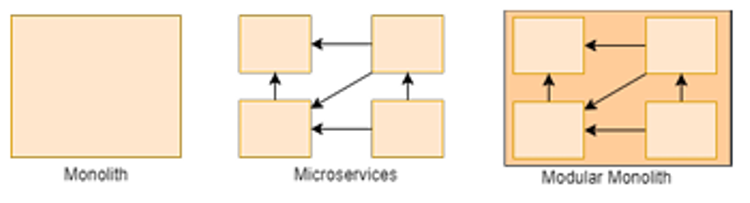

# Monolito Modular

## 🔎 Oque é ?
O monolito modular, também conhecido como modulito, é uma solução, proposta pela Google através do framework "Service Weaver", que nos permite juntar o melhor dos dois mundos: a velocidade de desenvolvimento de um monolito com a escalabilidade, segurança  e tolerância a falhas dos microserviços. Esta arquitetura tem a capacidade de manter as escolhas em aberto, ou seja, pode evoluir para um monolito clássico ou para uma arquitetura em microserviços conforme a necessidade do aplicativo. A figura 1 ilustra as diferenças entre ambas as arquiteturas.

  
*Figura 1: Comparação entre monolito, monolito modular e microserviços. Fonte:*

Algumas características cruciais dos monolitos modulares são:
- Segregação de módulos : Cada módulo é independente, assim como nos microserviços, com cada um deles contendo seu próprio conjunto de testes.  
- Modularidade com baixo acoplamento e alta coesão: Comunicação entre módulos ocorre através de APIs. De preferência, adotando comunicação assincrona entre os módulos.
- Base de dados únificada 
- Estrutura de deploy similar ao monolíto: operam todas em uma máquina virtual ou todas em máquinas virtuais dedicadas, a escala dos módulos tornam a conteinerização deles impraticável.
- Processo de aplicação unificada: aplicação opera como um único processo, oferecendo uma solução uniforme além de velocidade e simplicidade no desenvolvimento.
- Manutenabilidade e escalabilidade: 

Quanto a estutura de código , o monolito modular deve conter vários modulos funcionais sendo  utilizado uma interface que liga-o com o mundo exterior. A literatura propoe uma estutura geral dividida em duas maneiras: 
- Externamente: o módulo oferece uma API que se comunica via REST HTTP ou GRPC com as chamadas sendo gerenciadas por um proxy ou gateway.
- Internamente: Os serviços acessam um módulo via uma interface abstrata permitindo a obtenção de informações sem acesso direto à implementação.

Quanto à testabilidade do monólito modular, como já mencionado, cada módulo pode ser testado individualmente. Além disso, ao contrário da arquitetura de microserviços, é possível realizar testes de integração de forma mais simples e eficiente, pois todos os módulos estão contidos na mesma aplicação. Ademais é essencial que os desenvolvedores revisem e refatorem regularmente o monólito modular, mantendo a base de código organizada, de fácil manutenção e adaptável a mudanças nos requisitos de negócio.

## 📎 Provas de conceito

Para submeter o monolito modular as provas de conceito, os modulos foram separados da mesma maneira dos microserviços além de também ser utilizado a arquitetura onion para realizar a comunicação interna dos módulos. Ao desenvolver o modulito, foi observado muita facilidade para testar a aplicação, além de, como sugerido pela literatura, uma facilidade para transicionar entre o monolito clássico e os microserviços. Todavia, ao se desenvolver, mostrou uma repetição grande dos processos, oque pode gerar fácilmente uma repetição de código caso não refatorado.

## 🧅 Arquitetura Onion
A **Onion Architecture** é uma abordagem para sistemas corporativos complexos, focada na **separação de responsabilidades** e na redução do **acoplamento** entre componentes.
### Principais conceitos
1. **Domínio no centro**:  
   O núcleo da aplicação é o **Domain Model**, responsável pela lógica de negócios e regras. Camadas externas, como UI e infraestrutura, não afetam o núcleo.
2. **Infraestrutura externa**:  
   Banco de dados e outros sistemas externos são acessados apenas por meio de interfaces definidas no núcleo, facilitando mudanças.
3. **Redução de acoplamento**:  
   Todas as dependências apontam para o núcleo, evitando que mudanças em detalhes externos impactem a lógica central.
4. **Princípio da inversão de dependência**:  
   O núcleo define interfaces e depende de implementações fornecidas pelas camadas externas, promovendo flexibilidade e manutenção.

## 🪐 SonarQube
A figura 2 apresenta os dados coletados pelo SonarQube referentes a esta arquitetura, vale ressaltar que devido a configurações do sonar, não foi possível coletar a cobertura dos testes automaticamente.

  
*Figura 2: SonarQube. Fonte:Autor*  

Vale ressaltar, que o projeto demora cerca de 5 segundos para buildar e compilar, algo muito problemático pois os outros projetos demoram cerca de 2 segundos em mesmas condições.

## 📖 Referências

1. Su, R., & Li, X. (2024). Modular Monolith: Is This the Trend in Software Architecture? *Proceedings of the 1st International Workshop on New Trends in Software Architecture*, 10–13. Association for Computing Machinery, New York, NY, USA. DOI: [10.1145/3643657.3643911](https://doi.org/10.1145/3643657.3643911).

2. Tsechelidis, M., Nikolaidis, N., Maikantis, T., & Ampatzoglou, A. (2023). Modular Monoliths the Way to Standardization. *Proceedings of the 3rd Eclipse Security, AI, Architecture and Modelling Conference on Cloud to Edge Continuum*, 49–52. Association for Computing Machinery, New York, NY, USA. DOI: [10.1145/3624486.3624506](https://doi.org/10.1145/3624486.3624506).

3. Palermo, J. (2008, julho). The Onion Architecture (Part 1). *Programming with Palermo*. Disponível em: [https://jeffreypalermo.com/2008/07/the-onion-architecture-part-1/?source=post_page-----551f460c3b2c--------------------------------](https://jeffreypalermo.com/2008/07/the-onion-architecture-part-1/?source=post_page-----551f460c3b2c--------------------------------).

## 📅 Versionamento

| Versão |    Data    |         Descrição          |  Autor(es)  |
| :----: | :--------: | :------------------------: | :---------: |
| `1.0`  | 04/12/2024 | Criação de documento | Kauã |
| `1.1`  | 19/12/2024 | Adição do sonar e das referências | Kauã| 
| `1.2`  | 11/01/2024 | Adição do tempo 
